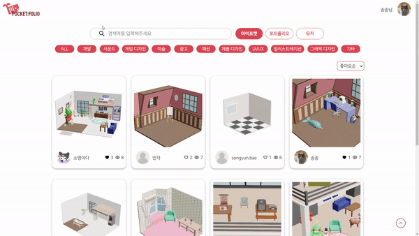
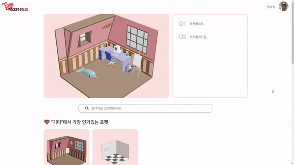
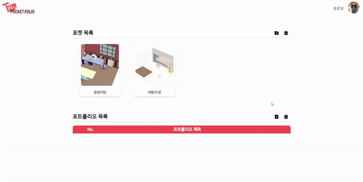
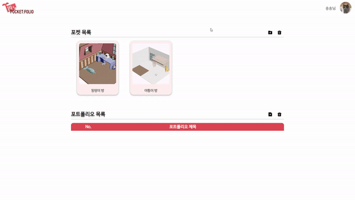
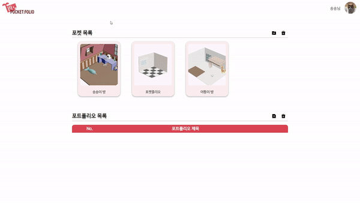
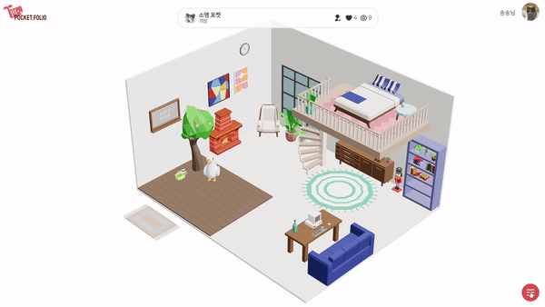
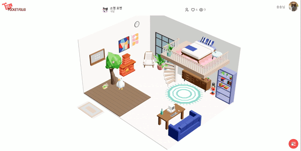
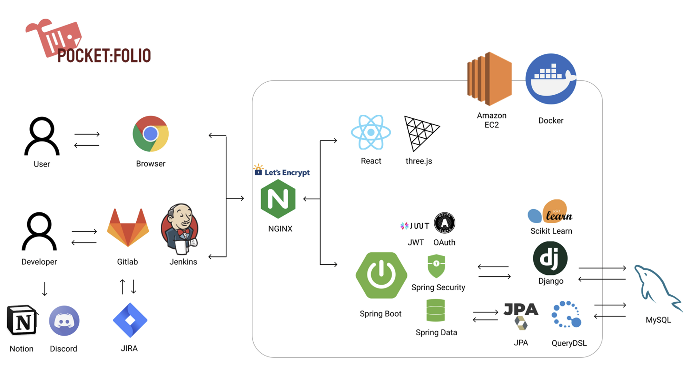

# Pocket:folio
📆 **프로젝트 진행기간: 2022/10/11 - 2022/11/21**

🎈 **팀원소개**
	🖥 **FE** : 강민재, 안정현, 이승현, 배송윤
	⌨ **BE** : 배상현, 이소영

📺 **UCC** : [UCC 링크](https://www.youtube.com/watch?v=k54Di5gQTKI)


------

## 01. 서비스 소개

포켓폴리오는 Pocket과 Portfolio를 합쳐 만든 이름으로 자신의 포트폴리오를 3D 공간인 포켓에 전시하고 공유할 수 있는 서비스입니다.

여러 개의 포켓을 포트폴리오의 컨셉에 맞게 꾸밀 수 있어 사용자의 개성을 드러낼 수 있습니다.

각 카테고리별 좋아요 순, 좋아요/팔로우 등의 방식으로 메인에 추천 포켓이 노출되기에 사용자들의 취향이나 좋은 아이디어를 볼 수 있으며 포켓 내의 방명록을 통해 유저 간 소통이 가능합니다.


## 02 주요 기능

- ck-editor를 이용한 포트폴리오 작성 및 관리, 공유
- 포켓 및 사용자 검색
- 3D 오브젝트를 이용한 포켓 꾸미기
- 오브젝트와 포트폴리오를 연결하여 전시
- 랜덤한 유저의 방을 구경하는 파도타기
- 팔로우, 방명록을 통한 소통

## 03. 서비스 화면

### 1. 랜딩 페이지


### 2. 로그인 


### 3. 메인 

- 비로그인 : 예시 포켓이 랜더링
- 로그인 : 자신의 메인 포켓이 랜더링

.gif)

### 4. 검색 기능

- 포트폴리오, 포켓, 유저 이름으로 검색 가능
- 검색결과는 카테고리 및 좋아요, 조회수, 팔로우 순으로 필터링 및 정렬 가능



### 5. 포켓, 포트폴리오 리스트

- 유저가 생성한 포켓과 포트폴리오 목록 조회 
- 해당 작품 클릭 시 상세 페이지로 이동



### 6. 포트폴리오 (작성, 수정, 삭제)



### 7. 포켓 생성



### 8. 포켓 상세정보 및 삭제 

- 포켓 이름 수정이 가능하며, 유저의 포켓 목록, 방문자 리스트 조회 가능



### 9. 포켓 테마 및 오브젝트 관리

- 테마 변경 또는 오브젝트 추가, 회전, 이동, 삭제 가능
- 포트폴리오와 연결하여 전시 가능


### 10. 오브젝트와 포트폴리오 연결

- 상호 연결된 오브젝트 및 포트폴리오 클릭 시,
  해당 오브젝트로 시점 전환 후 포트폴리오 상세 조회


### 11. 방명록 작성

- 다른 유저의 포켓에 방명록 작성 가능 (비공개 설정 시 주인에게만 보여짐)



### 12. 파도타기, url 복사

- 랜덤한 유저의 포켓에 방문
- URL 복사 버튼으로 해당 포켓의 URL 복사 가능



## 04. 개발환경

### Backend

```
# Django
Django==4.1.2
django-cors-headers==3.13.0
djangorestframework==3.14.0
drf-yasg==1.21.4
gunicorn==20.1.0
konlpy==0.6.0
mysqlclient==2.1.1
numpy==1.23.4
pandas==1.5.1
PyMySQL==1.0.2
scikit-learn==1.1.2
scipy==1.4.1
tensorflow==2.10.0

# Spring Boot
spring-boot:2.7.4
querydsl:1.0.10
gson:2.9.0
springdoc:1.6.12
jjwt:0.9.1
commons-io:2.11.0
spring-cloud-starter-aws:2.2.6.RELEASE
tika-core:2.6.0

# DB
mysql:8.0.31

# Server
docker:20.10.12
nginx:1.23.2
```

### Frontend

```json
# React
@ckeditor/ckeditor5-build-decoupled-document: 35.3.0
@ckeditor/ckeditor5-react: 5.0.2
@react-three/drei: 9.40.0
@react-three/fiber: 8.9.0
@reduxjs/toolkit: 1.8.6
axios: 1.1.3
prettier: 2.7.1
react: 18.2.0
react-dom: 18.2.0
react-hot-toast: 2.4.0
react-icons: 4.6.0
react-redux: 8.0.4
react-router-dom: 6.4.2
react-scripts: 5.0.1
redux: 4.2.0
redux-persist: 6.0.0
redux-thunk: 2.4.1
styled-components: 5.3.6
three: 0.145.0
```

## 05. 서비스 아키텍처



## 06. 협업 툴

- Gitlab

- Jira

  

- Notion

  

## 07. 서비스 설계

- **Figma**

  

- **기능 정의**

  

- **ERD**

  

- **Rest API**
